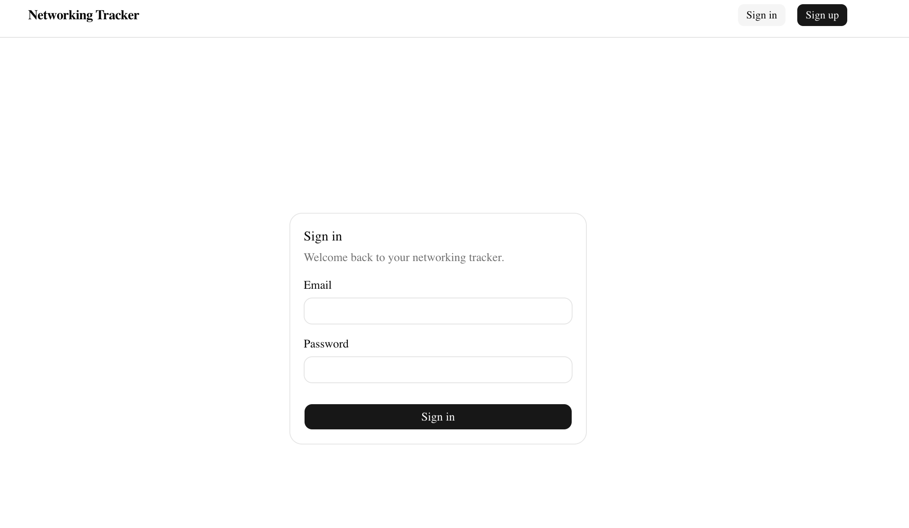
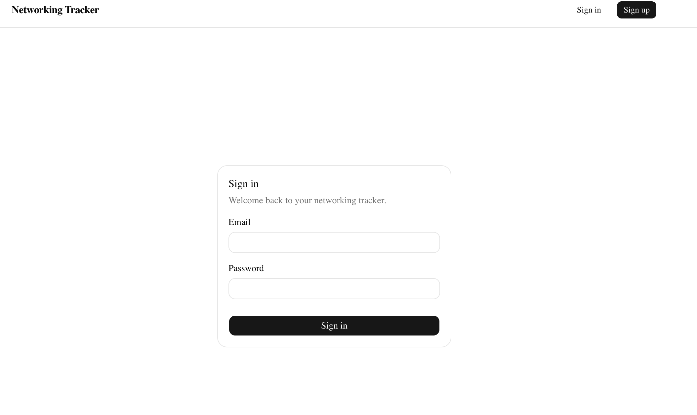
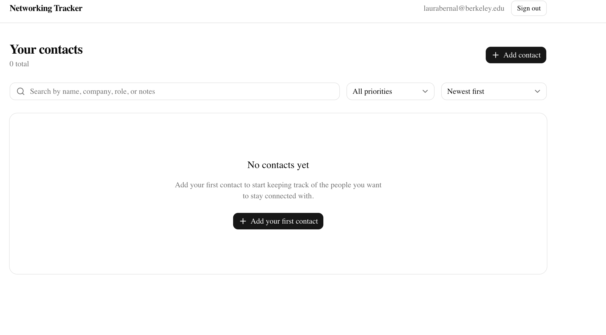
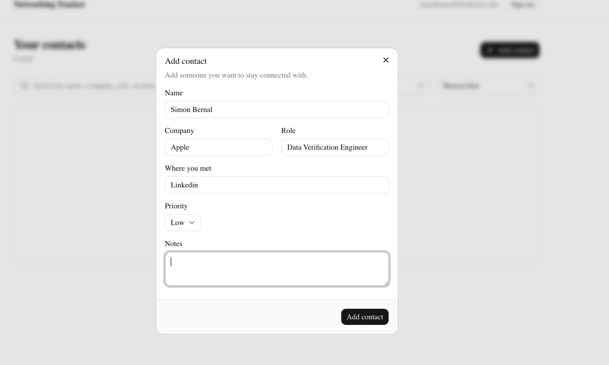
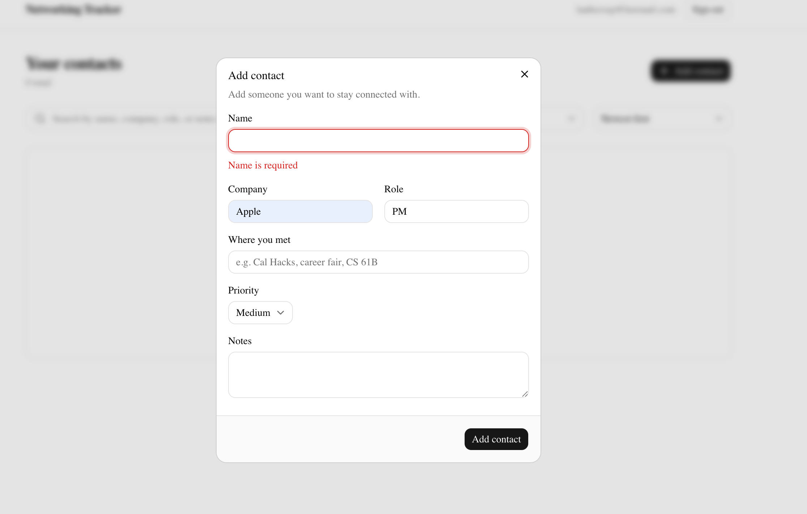
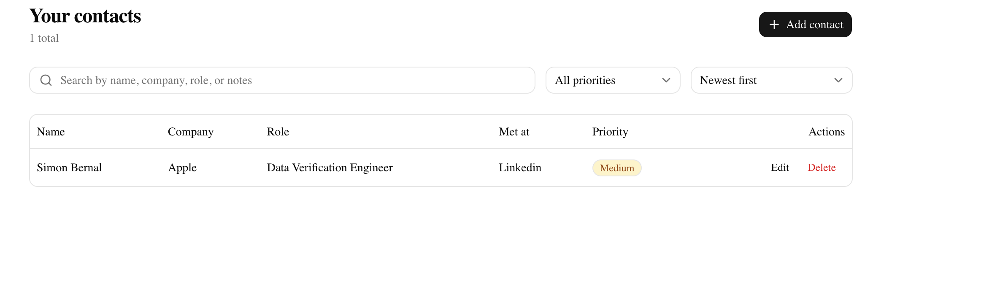
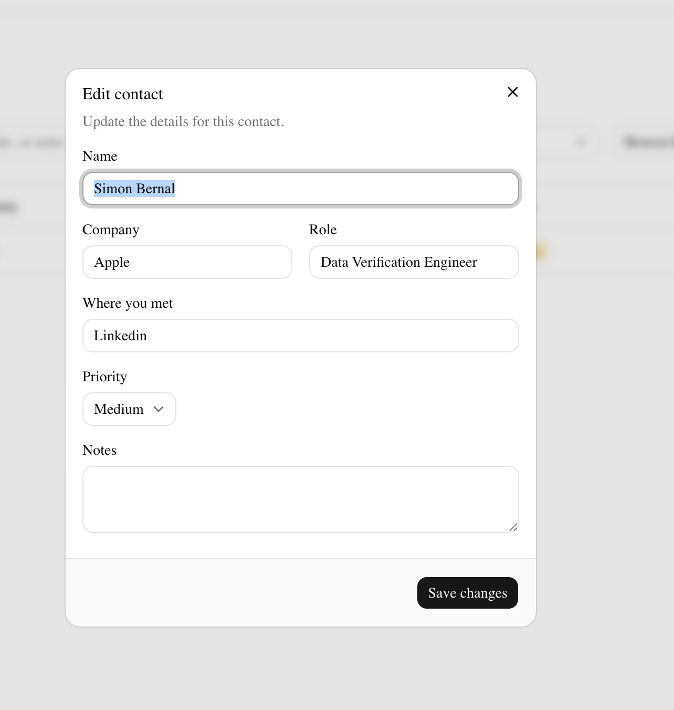
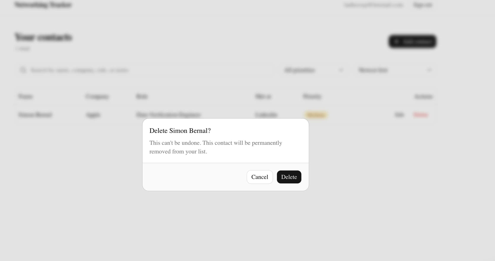
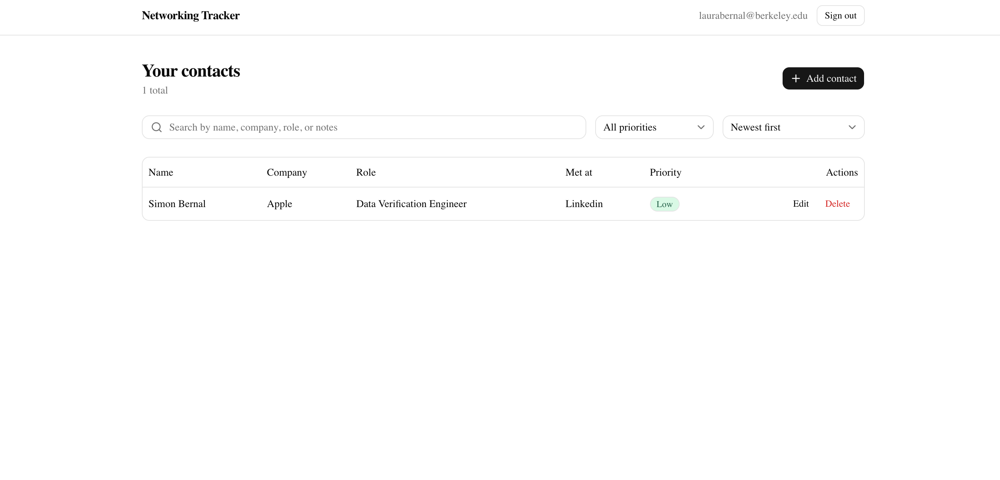
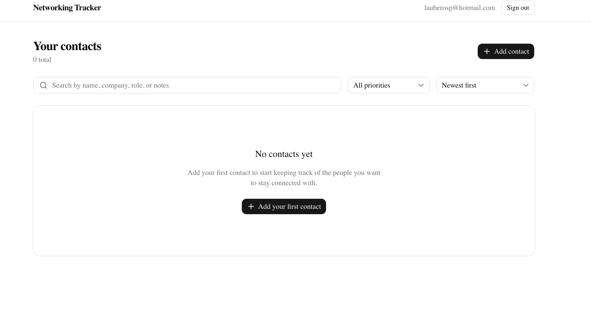

# Networking Tracker

A private, secure contact tracker for the people you want to stay connected
with at Berkeley — companies, roles, where you met, notes, and a priority
level, all scoped to your own account.

**Live app:** https://networking-tracker-ochre.vercel.app

## Screenshots / walkthrough

| Sign in | Signed out |
|---|---|
|  |  |

| Empty state | Add contact |
|---|---|
|  |  |

| Invalid input fails safely | Contact saved |
|---|---|
|  |  |

| Edit contact | Delete confirmation |
|---|---|
|  |  |

| Account A has a contact | Account B sees nothing |
|---|---|
|  |  |

All captured against the live app at the URL above. The first six flows used
a real `@berkeley.edu` account; the last pair uses two distinct accounts
(`laurabernal@berkeley.edu` and a separate `@hotmail.com` address) to show
each only ever sees its own contacts.

## Features

- Email/password sign-up, sign-in, and sign-out
- Add, view, edit, delete, sort, and filter contacts
- Required fields: name, company, role, where you met, notes, priority
  (`high` / `medium` / `low` only)
- Search across name, company, role, and notes; filter by priority; sort by
  name, company, priority, or date added
- Contacts persist across refresh (stored in Postgres, not local state)
- Clear loading, empty, success, and error states throughout
- Responsive layout: a table on desktop, stacked cards on mobile
- Every contact is private to its owner, enforced by Postgres Row Level
  Security — not just hidden in the UI

## Technology stack

| Layer | Choice | Why |
|---|---|---|
| Frontend | Next.js (App Router) + TypeScript | Single framework for both frontend routes and backend route handlers, first-class Vercel support |
| Styling / components | Tailwind CSS + shadcn/ui | A real component system (the assignment's requirement) with accessible, themeable primitives (dialogs, tables, forms) instead of hand-rolled CSS |
| Backend | Next.js Route Handlers (`app/api/**`) | A separated backend layer for server-side validation, independent of the UI |
| Database | Neon Postgres | Serverless Postgres with branching, generous free tier, and native RLS/JWT support |
| Auth | Neon Managed Better Auth | Managed email/password auth issuing JWTs that Postgres RLS can read directly via `auth.user_id()` — no separate auth server to run |
| Data access | Neon Data API (`@neondatabase/neon-js`) | A REST layer over Postgres that enforces RLS on every request, called directly from the client with the signed-in user's JWT |
| Testing | Vitest | Fast, zero-config unit testing for the validation logic |
| Hosting | Vercel | Zero-config Next.js deployment, environment variable management, preview deployments |

## Architecture

```
┌──────────────────────┐        ┌────────────────────────────┐
│   Browser (client)    │        │        Neon project         │
│                        │        │                              │
│  React components      │──────▶│  Managed Better Auth         │
│  (sign-in/up, contacts)│  JWT   │  (email/password → JWT)      │
│                        │        │                              │
│  @neondatabase/neon-js │──────▶│  Data API (PostgREST-style)  │
│  client (auth + CRUD)  │  REST  │  validates JWT, enforces RLS │
│                        │        │        │                     │
│  fetch() ─────────────┼───────▶│        ▼                     │
└──────────┬─────────────┘  validate  Postgres `contacts` table  │
           │              only        (RLS: owner-only policies) │
           ▼                        └────────────────────────────┘
┌──────────────────────┐
│ Next.js Route Handler │
│ /api/contacts/validate│
│ (zod, server-side)    │
└──────────────────────┘
```

- **Frontend**: React client components call the Neon Data API directly
  (`lib/neon.ts`) for every read/write, using the signed-in user's JWT. This
  is the pattern Neon's own SDK is built for — the JWT is attached to every
  request automatically, and Postgres RLS is the real security boundary
  regardless of what the client sends.
- **Backend**: Every create/edit first calls `POST /api/contacts/validate`,
  a Next.js Route Handler that re-validates the payload with the same `zod`
  schema (`lib/validation.ts`) used by the automated test. This is a genuine
  server-side validation step — a request crafted to skip the UI still gets
  rejected here with field-level errors — separate from (and in addition to)
  the database-level `CHECK` constraints in `db/schema.sql`, which are the
  layer that can't be bypassed even by a direct Data API call.
- **Database**: a single `contacts` table with RLS enabled and four
  ownership policies (select/insert/update/delete), all keyed on
  `auth.user_id() = user_id`. See [Schema](#database-schema) below.
- **Auth**: Neon Managed Better Auth, wired up client-side only
  (`BetterAuthReactAdapter`) — there is no custom auth server in this repo.
  Because the Auth service lives on a different origin than the app, the
  adapter is configured with `fetchOptions: { credentials: "include" }`
  (`lib/neon.ts`) so the session cookie actually gets sent cross-origin;
  without it the client silently falls back to an anonymous session.
- **Hosting**: the whole app (frontend + `/api` routes) deploys as one
  Vercel project.

## Local setup

Prerequisites: Node 20+, a [Neon](https://neon.tech) account.

1. **Clone and install**

   ```bash
   git clone <this-repo-url>
   cd networking-tracker
   npm install
   ```

2. **Create a Neon project and enable Auth + the Data API**

   Either through the [Neon console](https://console.neon.tech) — create a
   project in an **AWS** region (Managed Better Auth requires AWS), open
   **Auth** and enable Managed Better Auth, open **Data API** and enable it
   with **Use Neon Auth** and **Grant public schema access** both on, then
   copy the **Auth URL** and **Data API URL** shown on those pages —

   or with the [Neon CLI](https://neon.com/docs/reference/neon-cli) (`npm i -g neon@latest`), which is what this repo was actually set up with:

   ```bash
   neon login
   neon link --project-id <your-project-id> --branch production -y
   neon config init   # scaffolds neon.ts
   ```

   then set `auth: true` and `dataApi: true` in the generated `neon.ts` and run:

   ```bash
   neon deploy   # enables Auth + Data API, pulls the URLs into .env.local
   ```

3. **Create the schema**
   - Open the Neon **SQL Editor** and run the contents of
     [`db/schema.sql`](db/schema.sql) (or `neon psql production --pooled
     --role-name neondb_owner -- -f db/schema.sql`, or
     `psql "$DATABASE_URL" -f db/schema.sql`).
   - This must run as `neondb_owner` (or another owner-level role) — the
     script both creates the table/policies and `GRANT`s table privileges to
     the `authenticated` role the Data API uses. RLS policies alone are not
     enough: Postgres also requires the role to have SELECT/INSERT/UPDATE/
     DELETE grants on the table, or every Data API request gets a blanket
     403 regardless of policy.

4. **Configure environment variables**

   ```bash
   cp .env.example .env.local
   ```

   Fill in `NEXT_PUBLIC_NEON_AUTH_URL` and `NEXT_PUBLIC_NEON_DATA_API_URL`
   from step 2. `DATABASE_URL` is only needed if you run the schema via
   `psql` instead of the SQL Editor.

5. **Run it**

   ```bash
   npm run dev
   ```

   Open http://localhost:3000, sign up, and start adding contacts.

## Environment variables

| Variable | Where it's used | Notes |
|---|---|---|
| `NEXT_PUBLIC_NEON_AUTH_URL` | Client (public) | Neon Auth endpoint; safe to expose — auth is protected by password + JWT signing, not URL secrecy |
| `NEXT_PUBLIC_NEON_DATA_API_URL` | Client (public) | Neon Data API endpoint; safe to expose — RLS protects every row regardless of who can reach this URL |
| `DATABASE_URL` | Local tooling only | Direct Postgres connection string, used only to run `db/schema.sql`; never used by the running app, never committed |
| `NEON_AUTH_BASE_URL` | Not used | Reserved for a future server-side auth proxy; this implementation runs auth entirely client-side |
| `NEON_AUTH_COOKIE_SECRET` | Not used | Same as above |

See [`.env.example`](.env.example) for the full file with placeholder values.

## Database schema

`contacts` table (see [`db/schema.sql`](db/schema.sql) for the full DDL):

| Column | Type | Notes |
|---|---|---|
| `id` | `uuid` | Primary key, default `gen_random_uuid()` |
| `user_id` | `text` | **Not null**, defaults to `auth.user_id()` — the owning user, set automatically on insert |
| `name` | `text` | Not null, `CHECK` rejects empty/whitespace-only names |
| `company` | `text` | Optional, defaults to `''` |
| `role` | `text` | Optional, defaults to `''` |
| `met_at` | `text` | Optional, defaults to `''` |
| `notes` | `text` | Optional, defaults to `''` |
| `priority` | `text` | Not null, `CHECK (priority in ('high','medium','low'))` |
| `created_at` | `timestamptz` | Default `now()` |
| `updated_at` | `timestamptz` | Default `now()`, kept current by a trigger on every update |

## Authentication and RLS ownership

- Sign-up/sign-in create a session with Neon Managed Better Auth, which
  issues a JWT containing the user's id.
- The `@neondatabase/neon-js` client attaches that JWT to every Data API
  request automatically.
- Postgres reads the JWT via the `pg_session_jwt` extension and exposes the
  user's id through `auth.user_id()`.
- The Data API's Postgres roles (`authenticator` / `anonymous` /
  `authenticated`) start with **no table privileges at all** — RLS only
  filters rows a role can already see, it doesn't grant access on its own.
  `db/schema.sql` explicitly runs
  `grant select, insert, update, delete on contacts to authenticated;`
  before enabling RLS; skipping this step is the single most common way to
  get an opaque 403 from the Data API even with correct policies.
- **Row Level Security is enabled on `contacts`**, with four separate
  policies:

  ```sql
  create policy "select_own_contacts" on contacts
    for select to authenticated using (auth.user_id() = user_id);

  create policy "insert_own_contacts" on contacts
    for insert to authenticated with check (auth.user_id() = user_id);

  create policy "update_own_contacts" on contacts
    for update to authenticated
    using (auth.user_id() = user_id)
    with check (auth.user_id() = user_id);

  create policy "delete_own_contacts" on contacts
    for delete to authenticated using (auth.user_id() = user_id);
  ```

  The `update` policy's `USING` clause stops a user from touching a row they
  don't already own, and its `WITH CHECK` clause stops them from changing a
  row they do own so that it points at someone else's `user_id`. Combined
  with `user_id text not null default auth.user_id()`, ownership is set once
  at insert time and can never be reassigned.
- This means even a handcrafted request straight to the Data API — bypassing
  the UI entirely — can only ever see or modify rows owned by the calling
  user. The frontend never filters by `user_id` itself; it doesn't have to.

## Testing

```bash
npm run test
```

Runs the Vitest suite in [`lib/validation.test.ts`](lib/validation.test.ts)
against the same `zod` schema used by the `/api/contacts/validate` route
handler. It verifies:

- an empty (or whitespace-only) name is rejected with a clear message
- a missing name is rejected
- an invalid `priority` value (anything other than `high`/`medium`/`low`) is
  rejected
- a fully valid contact passes
- a contact with only the required fields (name + priority) passes

Sample output (from this repo, against the live Neon project):

```
> networking-tracker@0.1.0 test
> vitest run

 RUN  v4.1.11 /networking-tracker

 Test Files  1 passed (1)
      Tests  5 passed (5)
   Duration  498ms
```

## Deployment

This repo is deployed at https://networking-tracker-ochre.vercel.app. Steps
taken (same ones you'd repeat for your own deployment):

1. `gh repo create networking-tracker --public --source=. --remote=origin`,
   then `git push -u origin main`.
2. `vercel link` to create/link the Vercel project, then add the two public
   env vars for Production (`NEXT_PUBLIC_` variables need `--visibility
   config --no-sensitive`, since Vercel otherwise defaults framework-prefixed
   vars to a secret type that Production/Preview reject):
   ```bash
   vercel env add NEXT_PUBLIC_NEON_AUTH_URL production --visibility config --no-sensitive
   vercel env add NEXT_PUBLIC_NEON_DATA_API_URL production --visibility config --no-sensitive
   ```
3. `vercel --prod` to build and deploy.
4. `neon neon-auth domain add https://<your-app>.vercel.app` (or add it in
   the Neon console under Auth → trusted domains) so the deployed origin can
   complete auth flows.
5. Open the live URL in a private browser window and confirm sign-up/sign-in
   work end to end — verified above in [Evidence](#evidence).

## Known limitations and next steps

- No password reset / email verification flow — out of scope for this
  assignment, but Better Auth supports both if needed later.
- Sorting and filtering happen client-side over the full contact list, which
  is fine at personal-networking scale but wouldn't scale to thousands of
  rows; the Data API's own `order`/filter query params would be the next
  step.
- No pagination — same reasoning as above.
- No contact photos/avatars.
- The `/api/contacts/validate` backend check and the database `CHECK`
  constraints currently duplicate the same rules; a follow-up could
  generate one from the other.
- On a hard page load, the header briefly shows "Sign in / Sign up" for
  well under a second before the session resolves and flips to the signed-in
  state (the `/contacts` page itself always waits for the real session before
  rendering or redirecting, so this is cosmetic, not a security gap). A
  follow-up could add a matching skeleton state to `SiteHeader` while
  `useSession()` is pending.

## Evidence

- **Automated test**: see [Testing](#testing) above — `npm run test` passes
  all 5 cases against the live schema/validation rules.
- **Sign-in / sign-out**: verified live at
  https://networking-tracker-ochre.vercel.app with a real `@berkeley.edu`
  account — signing in reaches `/contacts` signed in
  ([contacts-empty.png](docs/screenshots/contacts-empty.png)), signing out
  returns to the signed-out header
  ([sign-out.png](docs/screenshots/sign-out.png)).
- **Create / edit / delete / refresh**: verified live at the URL above —
  added a contact ([add-contact-filled.png](docs/screenshots/add-contact-filled.png) →
  [contacts-list.png](docs/screenshots/contacts-list.png)), hard-reloaded the
  page (full navigation, not a client route change) and confirmed it was
  still there, edited it via the [edit dialog](docs/screenshots/edit-contact.png)
  and confirmed the change stuck, then deleted it via the
  [confirm dialog](docs/screenshots/delete-confirm.png) and reloaded again to
  confirm the deletion persisted too.
- **Invalid input fails safely**: submitting an empty (whitespace-only) name
  shows an inline "Name is required" error on the field and does not close
  the dialog or write anything
  ([add-contact-validation-error.png](docs/screenshots/add-contact-validation-error.png));
  the same is true for a `priority` outside `high`/`medium`/`low` (only
  reachable by bypassing the `<select>`, which `/api/contacts/validate` and
  the database `CHECK` both still reject).
- **Two-account privacy**: two distinct accounts on the live app —
  `laurabernal@berkeley.edu`, which has one contact
  ([two-account-user-a.png](docs/screenshots/two-account-user-a.png)), and a
  separate `@hotmail.com` account that sees 0 contacts despite being signed
  in at the same time
  ([two-account-user-b-empty.png](docs/screenshots/two-account-user-b-empty.png)).
  This was also verified below the UI layer: using two other test accounts
  (`user-a-test@example.com` / `user-b-test@example.com`) against the live
  Neon project, User B called the Data API directly — not through the UI —
  against a contact ID owned by User A:
  ```js
  await neon.from("contacts").select("*").eq("id", userAContactId);   // → []
  await neon.from("contacts").update({ name: "Hacked" }).eq("id", userAContactId); // → [] (0 rows)
  await neon.from("contacts").delete().eq("id", userAContactId);      // → 0 rows deleted
  ```
  All three silently no-op under RLS — no error, no rows affected — and
  signing back in as User A confirmed the contact was completely unchanged.
  This proves the database enforces ownership, not just the UI: even a
  handcrafted request that skips the UI entirely still can't touch another
  user's row.
- **No secrets in Git**: `git ls-files | grep -i env` in this repo returns
  only `.env.example`; `.env.local` (containing `DATABASE_URL`, the pooled/
  unpooled connection strings, and the Vercel OIDC token) has never been
  committed.
